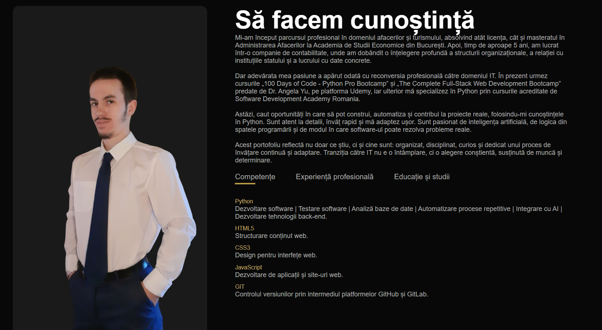
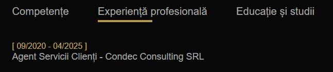
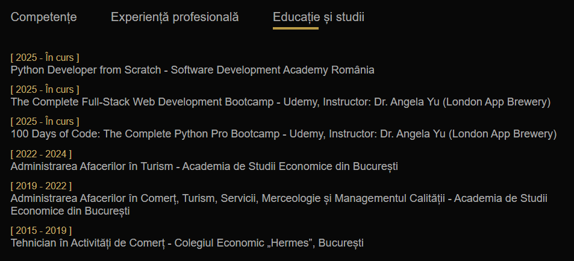
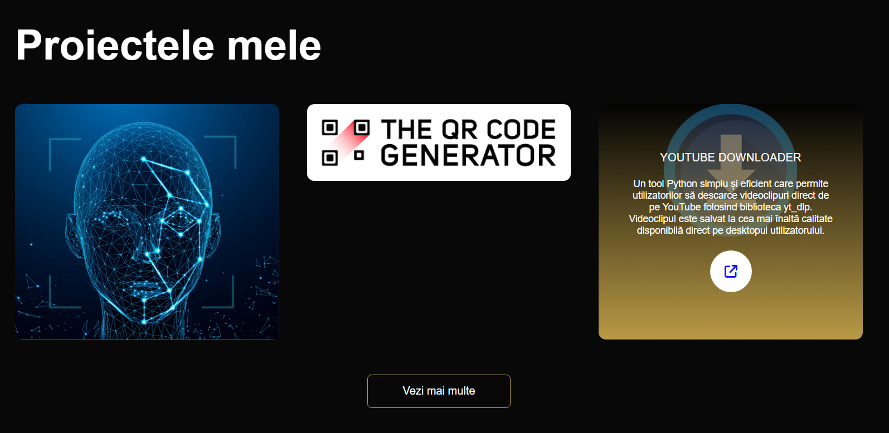
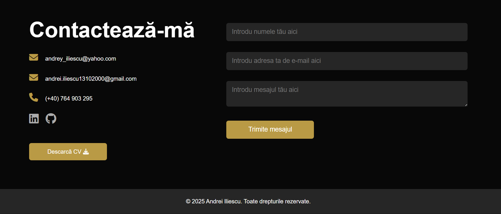

# 🌐 Andrei Iliescu — Website Personal de tip Portofoliu

---

## 📋 Cuprins
- 🏷️ [Descrierea Proiectului](#descrierea-proiectului)
- 💻 [Demo Live](#demo-live)
- 📷 [Screenshots](#screenshots)
- ✨ [Funcționalități](#funcționalități)
- 🛠️ [Tehnologii](#tehnologii)
- 🗂️ [Structura Proiectului](#structura-proiectului)
- 💾 [Instalare](#instalare)
- ⚠️ [Notițe](#notițe)
- 📜 [Licență](#licență)
- 👨🏻‍💻 [Autor](#autor--recunoștință--contact) / 🙏🏻 [Recunoștință](#autor--recunoștință--contact) / 📩 [Contact](#autor--recunoștință--contact)
- 💰 [Dacă vrei să îmi susții munca](#dacă-vrei-să-îmi-susții-munca)

---

## Descrierea Proiectului
Bine ai venit în repository-ul oficial al website-ului meu personal! Acest proiect reprezintă o pagină statică de prezentare, construită pentru a evidenția experiența, competențele și proiectele mele din domeniul IT.

Acest website este realizat exclusiv în HTML și CSS, fără framework-uri sau biblioteci JavaScript. Este o soluție minimalistă și responsivă pentru a prezenta:
- Un scurt profil profesional
- Competențele tehnice
- CV-ul personal în format PDF
- Elemente grafice de branding personal (logo, poze)
- Contact vizual curat, pregătit pentru publicare pe GitHub Pages
<!-- ## Badges -->

---

## Demo Live
[⛓️‍💥 Portofoliu](https://xandreiix.github.io/Andrei-Iliescu-Portfolio/)

---
## Screenshots
<p align="center">
   
</p>

<br>

<p align="center">
  
  
   
</p>

<br>

<p align="center">
  
  
</p>

<br>

<p align="center">
   
</p>

---

## Funcționalități
- Design 100% responsive
- Structură simplă, clară, ușor de extins
- Gata pentru deployment pe GitHub Pages
- Integrare CV PDF și branding vizual personalizat

---

## Tehnologii
- HTML5
- CSS3
- ❗ Proiectul **nu conține JavaScript** în această versiune.

---

## Structura Proiectului
- │ 📁 portofoliu/
- ├── index.html
- ├── project_showcase.html
- ├── style.css
- ├── ATS_CV_ANDREI ILIESCU_RO.pdf
- ├── about-1a1a1a-background-Photoroom.jpg
- ├── home-no-background.png
- ├── logo-no-background.png
- ├── shortcut-icon.jpeg
- ├── project-comin-soon.jpg
- ├── project-1.png
- ├── project-2.png
- ├── project-3.png
- ├── project-4.png
- ├── project-5.jpg
- ├── project-6.jpg
- ├── project-7.png
- ├── project-8.png
- ├── project-9.jpg
- ├── project-10.png
- ├── project-11.jpg
- ├── project-12.png
- ├── project-13.png
- ├── project-14.png
- ├── project-15.png
- ├── project-16.png
- ├── project-17.png
- ├── project-18.png
- ├── project-19.png
- ├── project-20.png
- ├── project-21.png
- ├── project-22.jpg
- ├── screenshots/
- │   └── hero-section.png
- │   └── aboute-me-section.png
- │   └── professional-experience.png
- │   └── studies.png
- │   └── my-projects.png
- │   └── more-of-my-projects.png
- │   └── contact-me.png
- ├── .gitignore
- ├── LICENSE
- └── README.md
<!-- ## Requirements -->
<!-- ## Usage -->
<!-- ## Configuration -->
<!-- ## Runing tests -->
<!-- ## Deployment -->
<!-- ## Road Map -->
<!-- ## FAQ -->
<!-- ## Contributing -->

---

## Instalare
1. Clonează repository-ul:
```bash
git clone https://github.com/xAndreiix/Andrei-Iliescu-Portfolio.git
```

---

## Notițe
Fișierul `.gitignore` este configurat să excludă:
- Fișiere temporare și de sistem (ex: `.DS_Store`, `Thumbs.db`)
- Cache și loguri
- Configurații locale pentru IDE-uri (`.vscode/`, `.idea/`)
- Foldere generate (ex: `node_modules/`, `dist/`, dacă vor fi adăugate pe viitor)

---

## Licență
Acest proiect este licențiat sub licența MIT - vezi [LICENȚA](LICENSE)

---

## Autor / Recunoștință / Contact
**Autor:** 
Andrei Iliescu

[](https://xandreiix.github.io/Andrei-Iliescu-Portfolio/)

**Recunoștință:**  
- Inspirat de tutorialul lui [GreatStack](https://www.youtube.com/@GreatStackDev) de pe YouTube.

[](https://www.youtube.com/watch?v=0YFrGy_mzjY&t=1565s&ab_channel=GreatStack)
- Toate mulțumirile către el, pentru tutorial!

**Contact:**  

[](https://linkedin.com/in/andrei-iliescu-aa7910214)<br>
[](mailto:andrey_iliescu@yahoo.com)<br>
[](mailto:andrei.iliescu13102000@gmail.com)

---

## Dacă vrei să îmi susții munca
[](https://paypal.me/xAndreiix)<br>
[](https://revolut.me/xandreiix)
